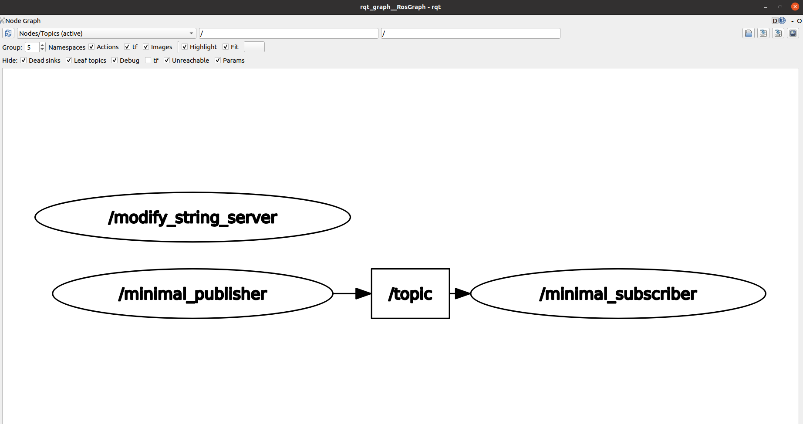

[](LICENSE.md)
# Beginers Tutorial 
## A simple Service Client with Publisher and Subscriber

### Dependencies
* Installed on Linux (Ubuntu 22.04)
* Ros 2 Humble installed 
* And a workspace created for ros2. If not then follow the instructions below:
<details>
<summary>How to create a ros Workspace?</summary>

```xml
mkdir -p ~/ros2_ws/src
cd ~/ros2_ws/src
```

</details>

### Building this package
These simple steps are to be followed to replicate the work of this repository from scratch

<details>
<summary>Clone this package </summary>
Inside your ros_workspace/src clone the following package

```xml 
git clone https://github.com/amancodeblast/beginner_tutorials.git
```
make sure you have selected the tag "Week10_HW"
</details>


<details>
<summary>Compile the package </summary>

Complile the package using the command 
```xml
colcon build --packages-select beginner_tutorials
``` 
</details>
<details>
<summary>Source the workspace and run the nodes using  a launch file </summary>

Open a new terminal, navigate to ros2_ws, and source the setup files:

```xml
. install/setup.bash
```

Now running the talker or publisher node

```ros2 launch final.yaml frequency:=10.0```

</details>

## Logging
* Invoke rqt console GUI
```xml 
rqt_console
rqt_graph
```

## Results
### RQT Output 
**LOGGER INFO**


## Running Linterand checker
<details>
<summary>Execute the following scripts for Linter and Checker output </summary>

```xml 
sh cpplint.sh
sh cppcheck.sh
```

</details>

